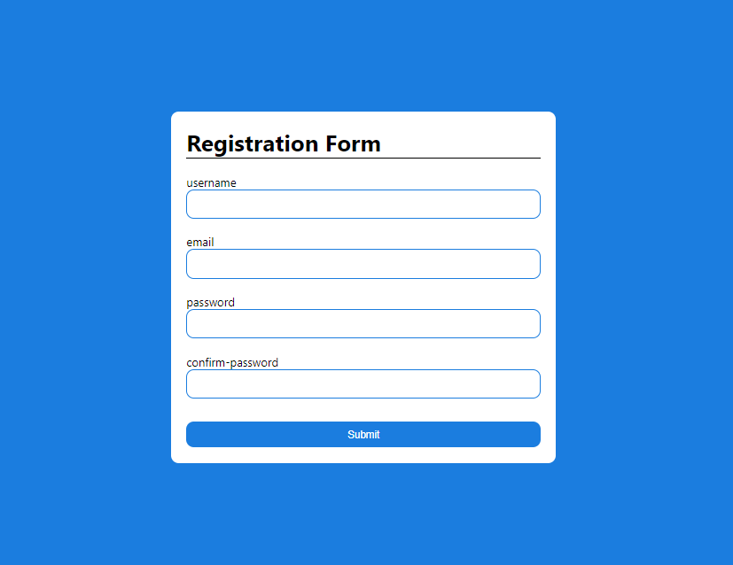
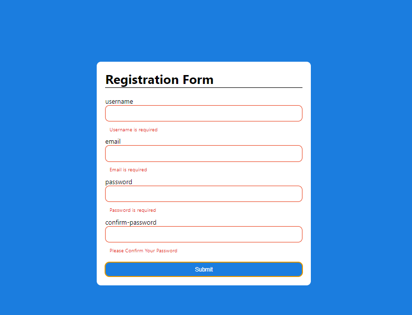
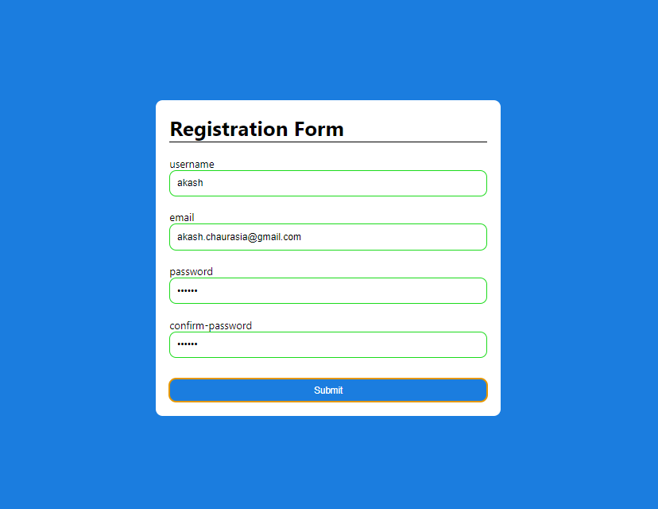

# Form Validation Project

A simple **Form Validation** project using **HTML**, **CSS**, and **JavaScript** to ensure that users input valid data in a form before submission. This project includes real-time validation for fields such as username, email, password, and more.

## Features

- Real-time validation for all input fields
- Custom error messages for invalid fields
- User-friendly design 
- Cross-browser compatible
- Clear visual feedback for valid and invalid inputs

## Screenshots

Here are some screenshots of the form validation in action:

*Valid Input Example*

*Invalid Input Example*

## Technologies Used

- **HTML5**: Structuring the form and elements
- **CSS3**: Styling the form, error messages, and validation feedback
- **JavaScript**: Implementing client-side validation logic

## Project Structure

form-validation
├── index.html        # Main HTML file
├── index.css        # Stylesheet for the form
├── index.js         # JavaScript for form validation
├── images/           # Folder for images and screenshots
└── README.md         # Project documentation
